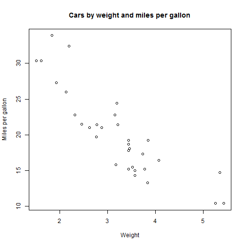

Course Project: Shiny Application
========================================================
author: HJL
date: 19.9.2016
autosize: true

General
========================================================

This presentation is a part of a Coursera Data Science Specialization course - Developping Data products.

Assigment: **Course Project: Shiny Application and Reproducible Pitch**

The app developped can be found https://xxxx.shinyapps.io/shiny_app_mtcars/

Sources for the application can be found https://github.com/hjl321/Shiny-Application-and-Reproducible-Pitch


Application overview 1
========================================================

Tool for selecting a suitable car.

**Selection criterias are**

* Number of cylinders
* Horsepower
* Transmission type


Application overview 2
========================================================

In Selected cars tab user can sort and filter data
using sorting and filtering tools of a table


Dataset overview
========================================================

Preview of a cars dataset.


```r
head(mtcars)
```

```
                   mpg cyl disp  hp drat    wt  qsec vs am gear carb
Mazda RX4         21.0   6  160 110 3.90 2.620 16.46  0  1    4    4
Mazda RX4 Wag     21.0   6  160 110 3.90 2.875 17.02  0  1    4    4
Datsun 710        22.8   4  108  93 3.85 2.320 18.61  1  1    4    1
Hornet 4 Drive    21.4   6  258 110 3.08 3.215 19.44  1  0    3    1
Hornet Sportabout 18.7   8  360 175 3.15 3.440 17.02  0  0    3    2
Valiant           18.1   6  225 105 2.76 3.460 20.22  1  0    3    1
```

Graphical overview 
========================================================


